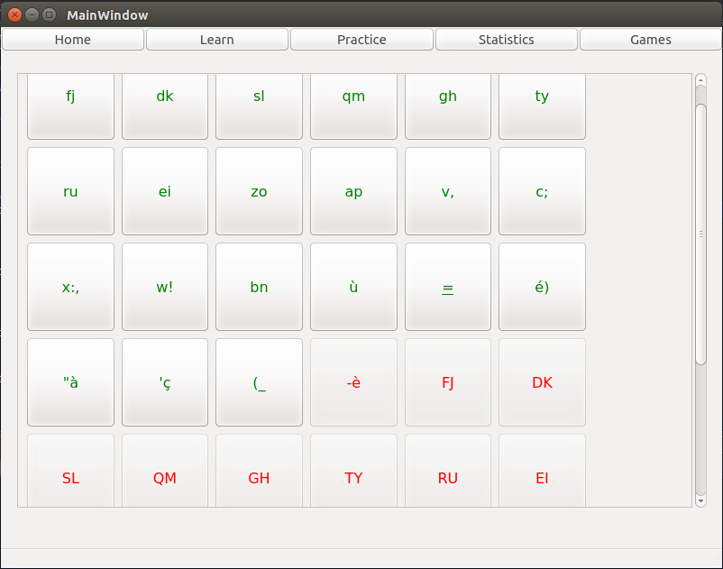
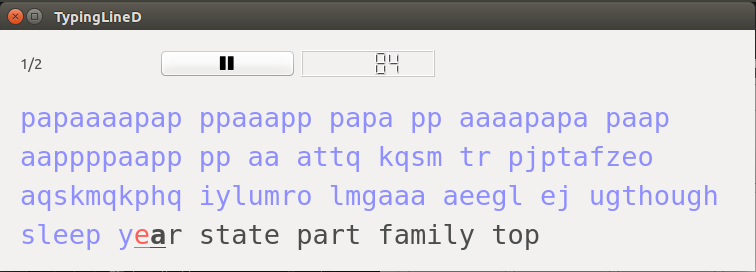
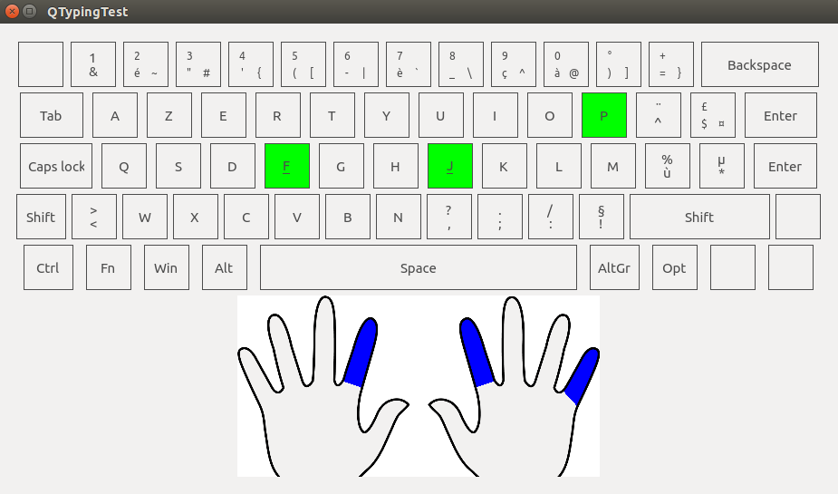
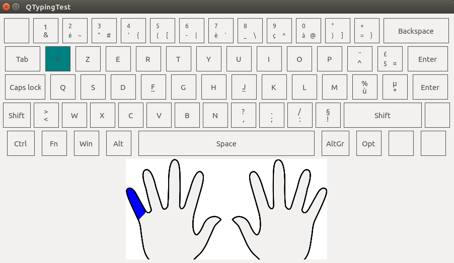

# QTyping test

QTypingTest is a software developed with Qt.
It teaches you how to type faster.
You can also practice some random words just to improve your speed.
Some statistics will be made to see your progression and you
will be able to train on exercise composed of the letters
you make the most mistake on.

Learn
---------
You can start from scratch and learn the position of the keys on you keyboard. Step by step.
A preview is displayed to show you what finger to use for what key.

Practice
--------
You have to type words. The difference with the learning exercises, is that there are only existing words. Not random-generated letters.

Text practice
--------------
Instead of typing series of random words, you have to type a real text. This exercise is the closest one to the reality.

Previews
--------

  

  

  

  

