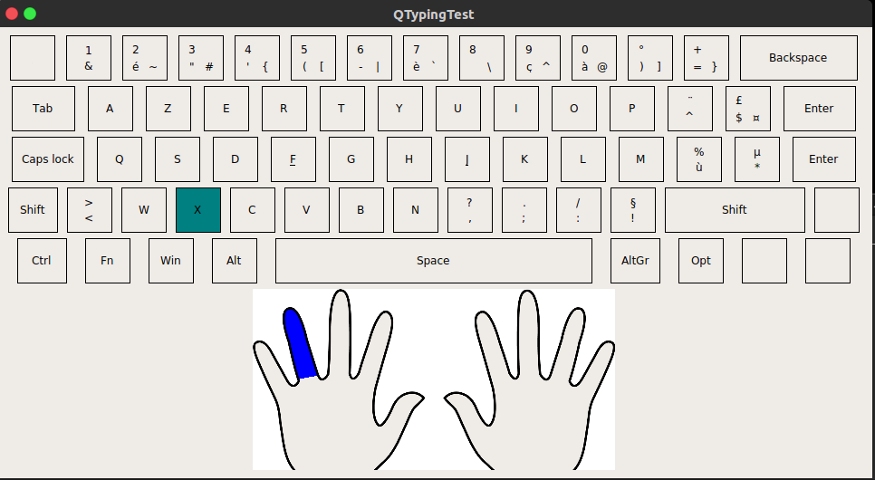
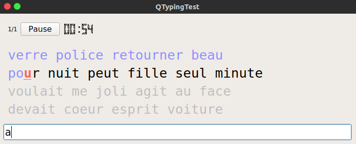
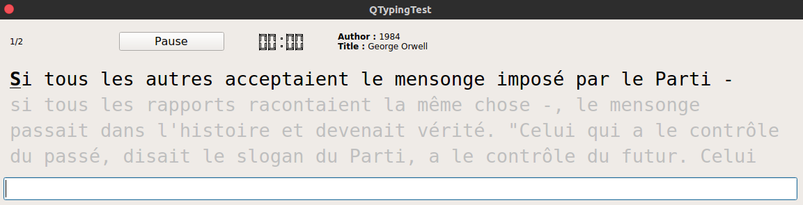
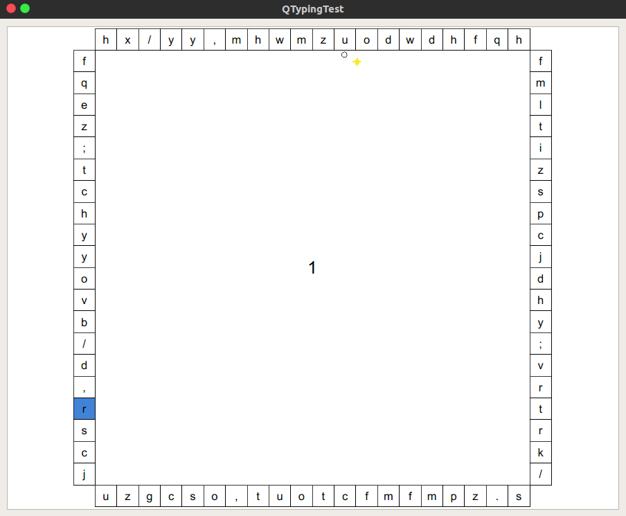
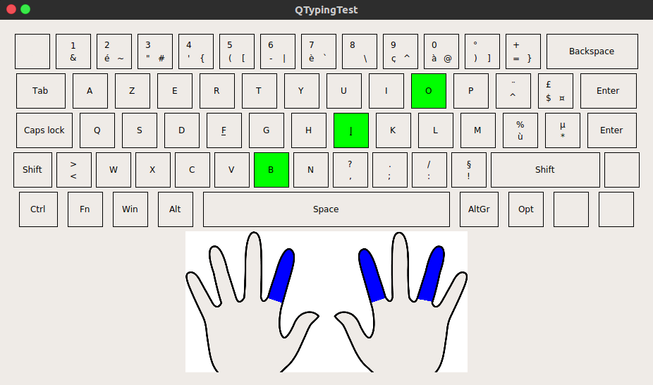
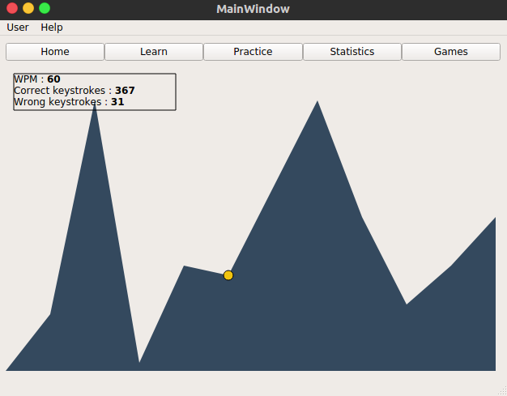

# QTyping test

QTypingTest is a software developed with Qt.
It teaches you how to type faster.
You can also practise some random words just to improve your speed.
You can see your progression thanks to a statistics tabs. All the mistakes you make
are saved and custom exercises are available for you to train especially on these
letters.

Learn
---------
You can start from scratch and learn the position of the keys on you keyboard. Step by step.
A preview is displayed to show you what finger to use for what key.

Practise
--------
You have to type words. The difference with the learning exercises, is that there are only existing words. Not random-generated letters.

Text practise
--------------
Instead of typing series of random words, you have to type a real text. This exercise is the closest one to the reality.

Play
----
Some games are available for you to practise while having fun.

Statistics
-----------
See your progression for every type of exercise you did.

Authors
-------
Azarias Boutin
Pierre Thubé